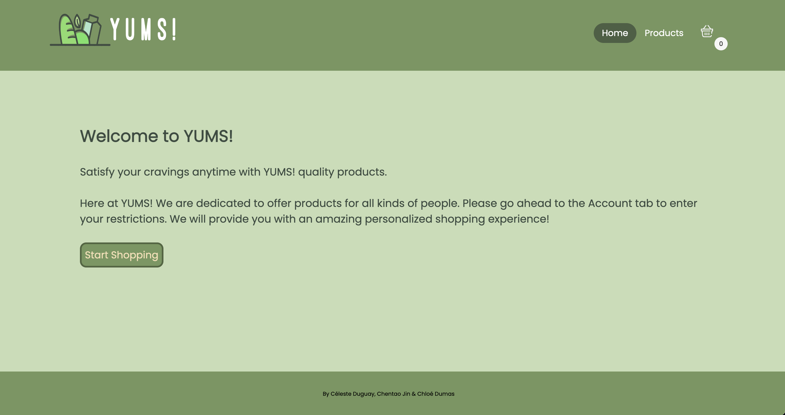
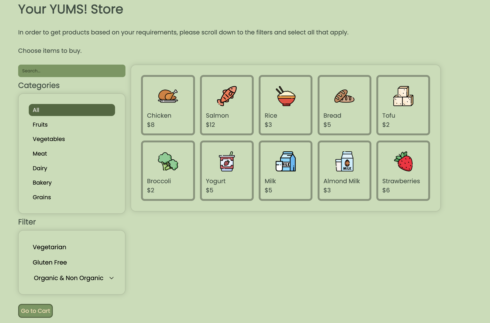
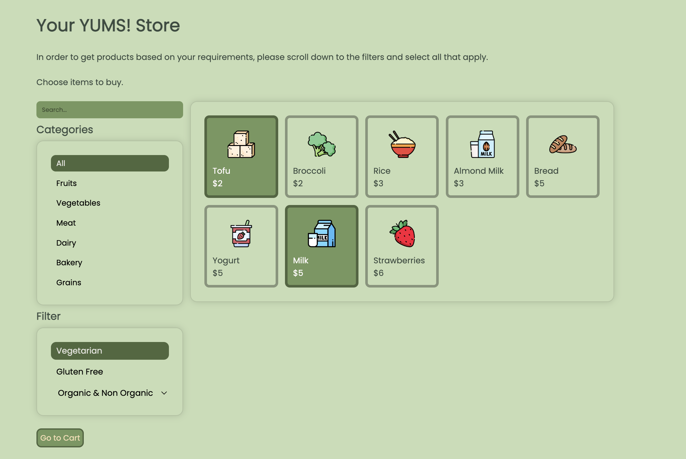
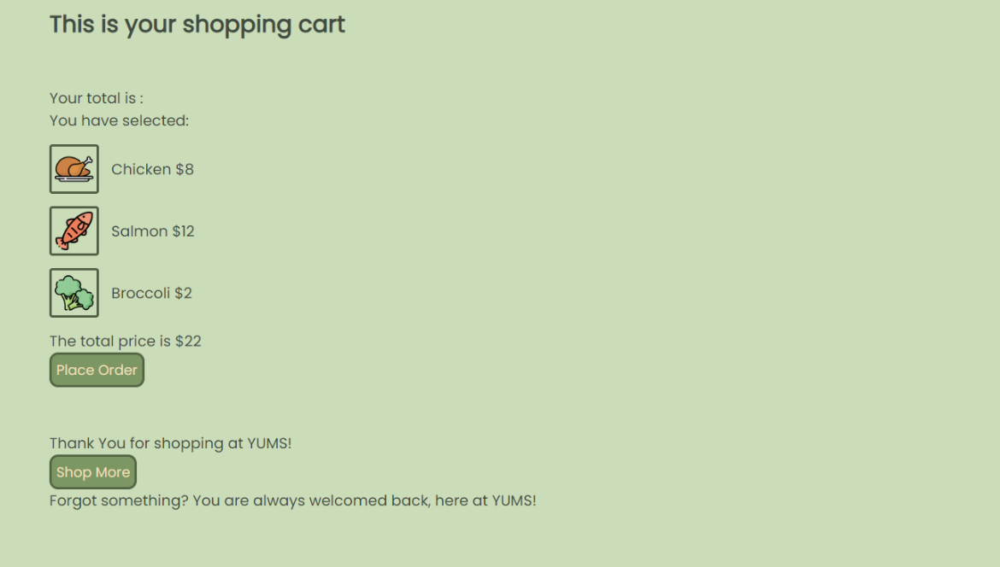
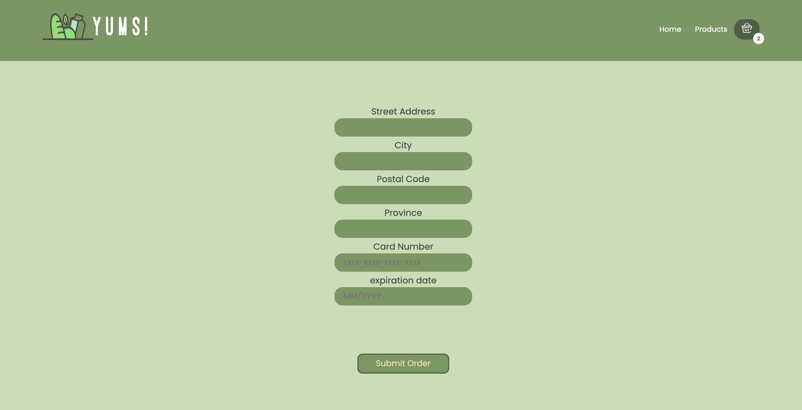

# 📎 My Grocery Store Website
This is a dynamic webpage using HTML, CSS and JavaScript created for lab 3 of SEG3125. This is an adaptive online grocery store website where the users with different requirements can get a personalized shopping list of products. We made sure in this new version that it is more user-centered. Adhering to many rules of ui, we made changes to make our website easier to navigate like adding buttons, better styling, better color choices and adding pictures.

👉🏻 This dynamic simple website is deployed Github Pages

👉🏻 Link to this GitHub repository: https://github.com/lixu4n/My-Grocery-Strore-V2 

👉🏻 Link to the GitHub repository of older website version: https://github.com/lixu4n/My-Grocery-Store 

👉🏻 Resources for our icons and logos: https://www.flaticon.com/ and for logo inspo: https://looka.com/logo-maker/?gclid=CjwKCAiAxP2eBhBiEiwA5puhNQFsV3BebR2xx8J8G71UoQJ1Igp-uStbCl0MkAhdHr7_f-Raxe9InBoCFcAQAvD_BwE 

# 📎 General Info
SEG3125

LAB 3 - Online Grocery Website Alternative Design (html, css, javascript)

GROUP #28

By Céleste Duguay, Chentao Jin & Chloé Dumas

# 📎 Contributions
Chentao Jin:

🔨 Html/css for dietary needs tab 
🔨 Html/css for cart tab 
🔨 Implemented the functionality to be able to add products to cart 
🔨 Implemented total price in cart tab 
🔨 Implemented toast confirmation when adding items to cart 
🔨 Implemented website signature 
🛠️ Implemented breadcrumbs and shipping info 
🛠️Added price to each product item in the cart
🛠️Added additional buttons to navigate between all the shipping steps 
🛠️Added checkout page

Céleste Duguay : 

🔨 Creation of basic html/css  
🔨 Implemented the styling of the site 
🔨 Implemented a functional navigation bar & tab switching 
🔨 Changed the order that products are displayed (show products from price low to high) 
🔨 Html/css for nav bar 
🔨 Added visual feedback representing which tab we currently
are on 
🛠️ New colours for nav bar 
🛠️ Added logos for cart and website title 
🛠️ Adjusted colours for both 
🛠️ Added search bar 

Chloé Dumas:
 
🔨 Creating issues and pull requests 
🔨 Implemented functionality to be able to change dietary needs and the view updated list in products tab 
🔨 Css for list of products 
🔨 Fixed signature position and layout 
🔨 Implemented responsiveness to main container 
🔨 Fixed button styling 
🛠️Added pictures for product 
🛠️Added Categories 
🛠️Changed products page layout for categories 
🛠️Moved filters (vegetarian, gluten free and organic) to the product page 
🛠️Changed input for organic to a dropdown select 

# 📎 See the previews of our Grocery Store website: 
This is the Home page: 
 

This is the Products tab: 
 

This is the Products tab when you select a filter: 
 

This is the navigation bar, it shows the number of products onto the cart logo: 
 

This is the Cart tab after you selected products to buy: 
 

This is the Cart tab once you click onto place order button: 
 