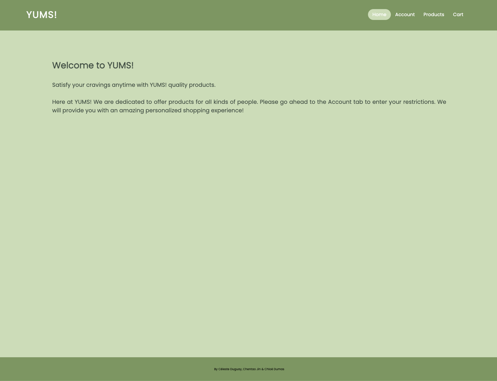
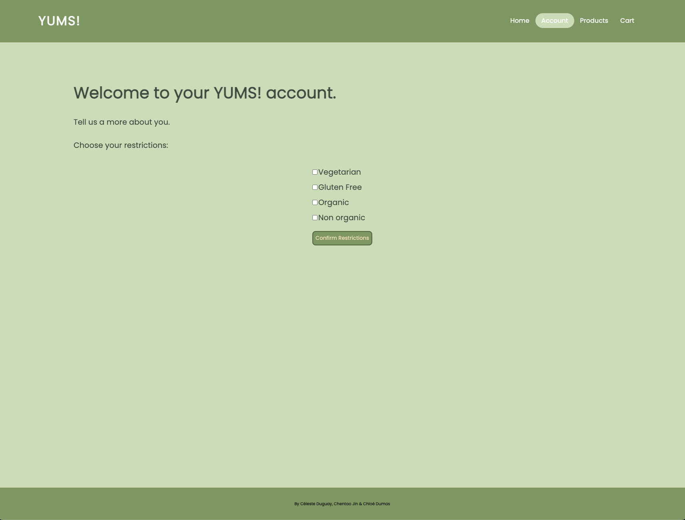
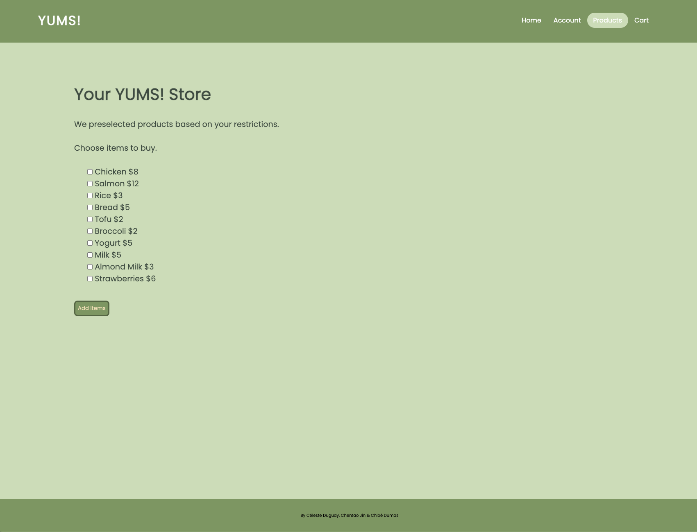
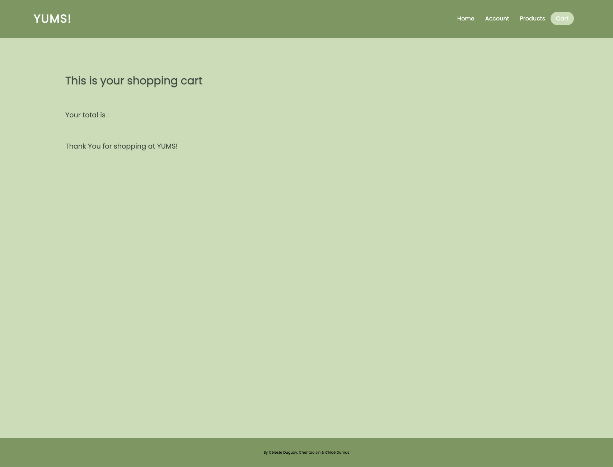

# 📎 My Grocery Store Website
This is a dynamic webpage using HTML, CSS and JavaScript created for lab 2 of SEG3125. This is an adaptive online grocery store website where the users with different requirements can get a personalized shopping list of products.

👉🏻 This dynamic simple website is deployed Github Pages

👉🏻 Link to this GitHub repository: https://github.com/lixu4n/My-Grocery-Store

# 📎 General Info
SEG3125

LAB 2 - Javascript

GROUP #28

By Céleste Duguay, Chentao Jin & Chloé Dumas

# 📎 Contributions
Chentao Jin:

🔨 Html/css for dietary needs tab 
🔨 Html/css for cart tab 
🔨 Implemented the functionality to be able to add products to cart 
🔨 Implemented total price in cart tab 
🔨 Implemented toast confirmation when adding items to cart 
🔨 Implemented website signature 

Céleste Duguay : 

🔨 Creation of basic html/css  
🔨 Implemented the styling of the site 
🔨 Implemented a functional navigation bar & tab switching 
🔨 Changed the order that products are displayed (show products from price low to high) 
🔨 Html/css for nav bar 
🔨 Added visual feedback representing which tab we currently
are on 

Chloé Dumas:
 
🔨 Creating issues and pull requests 
🔨 Implemented functionality to be able to change dietary needs and the view updated list in products tab 
🔨 Css for list of products 
🔨 Fixed signature position and layout 
🔨 Implemented responsiveness to main container 
🔨 Fixed button styling 

# 📎 See the previews of our Grocery Store website: 
This is the Home page: 
 

This is the Account tab: 
 

This is the Products tab: 
 

This is the Cart tab: 

